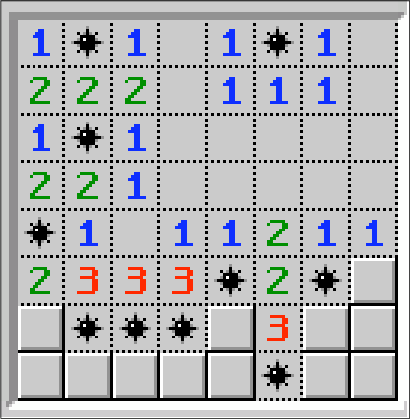

# flexbox-minefield

## About this project

This was a solo project carried out on the 14th of January 2021 as part of the BeCode Liège's Junior Web Developer programm. We were tasked to make a copy of the Minesweeper game using HTML and CSS, focusing on flexbox.

### Learning objectives

- [ ] Increasing your knowledge of HTML.
- [ ] Increasing your knowledge of CSS.
- [ ] Learning the basics of flexbox.

### The end result expected was : 
 

 
(As a bonus we could try to make the invisible boxes show their content on hover)

## [See my attempt here !](https://charlottemoureau.github.io/flexbox-minefield/)
